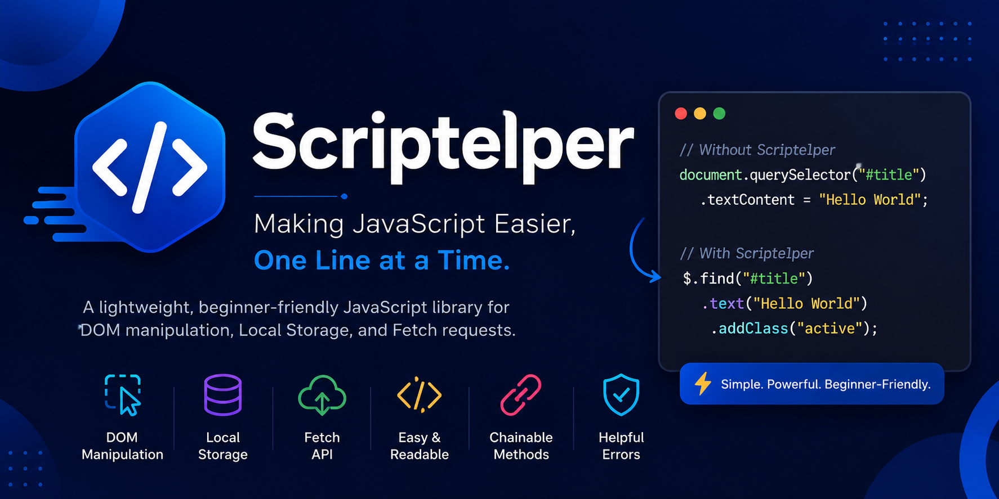

# Scriptelper

A lightweight, beginner-friendly JavaScript library for DOM manipulation, Local Storage, and Fetch requests.

# Scriptelper

**A lightweight, beginner-friendly JavaScript library for DOM manipulation, Local Storage, and Fetch requests.**

Scriptelper simplifies common JavaScript tasks with a clean, chainable API and beginner-friendly error messages.

---

# Why Scriptelper?

Working directly with the DOM can become repetitive:

```js
document.querySelector("#title").textContent = "Hello World";
```

With Scriptelper:

```js
$.find("#title").text("Hello World");
```

Scriptelper focuses on:

- Simplicity
- Readability
- Chainable APIs
- Helpful error messages
- Lightweight design
- Beginner-friendly learning

---

# Features

- DOM Selection
- Text Manipulation
- HTML Manipulation
- Event Handling
- CSS Class Helpers
- Show / Hide Elements
- Element Creation
- Attribute Helpers
- Form Value Helpers
- Local Storage Helpers
- Fetch API Helpers
- Chainable Methods

---

# Installation

## NPM

```bash
npm install scriptelper
```

## CDN

```html
<script src="https://unpkg.com/scriptelper"></script>
```

---

# Global Instance

```js
window.$ = new Scriptelper();
```

---

# DOM Selection

## find()

Returns the first matching element.

### Syntax

```js
$.find(selector);
```

### Examples

```js
$.find("#title");
$.find(".card");
$.find("button");
```

---

## findAll()

Returns all matching elements.

### Syntax

```js
$.findAll(selector);
```

### Example

```js
const cards = $.findAll(".card");

cards.forEach(card => {
    card.addClass("active");
});
```

---

# Element Methods

All methods below are available on elements returned by `find()`, `findAll()`, and `create()`.

---

## text()

Sets text content.

```js
$.find("#title").text("Welcome");
```

---

## html()

Sets HTML content.

```js
$.find("#box").html("<b>Hello World</b>");
```

---

## addClass()

Adds a CSS class.

```js
$.find("#box").addClass("active");
```

---

## removeClass()

Removes a CSS class.

```js
$.find("#box").removeClass("active");
```

---

## toggleClass()

Adds a class if it doesn't exist and removes it if it does.

```js
$.find("#box").toggleClass("active");
```

---

## replaceClass()

Replaces one class with another.

```js
$.find("#box").replaceClass("inactive", "active");
```

---

## toggle()

Shows or hides an element.

```js
$.find("#menu").toggle();
```

---

## value()

Set a value:

```js
$.find("#name").value("Samad");
```

Get a value:

```js
const name = $.find("#name").value();
```

---

## attr()

Set an attribute:

```js
$.find("#box").attr("data-id", "123");
```

Get an attribute:

```js
const id = $.find("#box").attr("data-id");
```

---

## on()

Adds an event listener.

```js
$.find("#btn").on("click", () => {
    console.log("Button clicked");
});
```

---

## off()

Remove all handlers:

```js
$.find("#btn").off("click");
```

Remove a specific handler:

```js
function handleClick() {
    console.log("Clicked");
}

$.find("#btn").off("click", handleClick);
```

---

## appendTo()

Appends an element to a parent.

```js
const div = $.create("div");

div.appendTo("#container");
```

---

## remove()

Removes the selected element from the DOM.

```js
$.find("#oldBox").remove();
```

---

# Creating Elements

## create()

Creates a new HTML element.

```js
const div = $.create("div");
```

Create and append directly:

```js
$.create("p", "#container");
```

Example:

```js
$.create("p")
    .text("Hello Scriptelper")
    .appendTo("#container");
```

---

# Local Storage

## store()

Stores data in Local Storage.

```js
$.store("user", {
    name: "Samad",
    age: 20
});
```

---

## load()

Retrieves data from Local Storage.

```js
const user = $.load("user");
```

---

## removeItem()

Removes stored data.

```js
$.removeItem("user");
```

---

## clear()

Clears all Local Storage data.

```js
$.clear();
```

---

# Fetch Helpers

## getData()

Fetches data from an API.

```js
const users = await $.getData(
    "https://jsonplaceholder.typicode.com/users"
);
```

---

## postData()

Sends data using a POST request.

```js
await $.postData(
    "https://jsonplaceholder.typicode.com/users",
    {
        name: "Samad"
    }
);
```

---

# Method Chaining

```js
$.find("#title")
    .text("Welcome")
    .addClass("active")
    .attr("data-loaded", "true");
```

---

# Example Project

## HTML

```html
<h1 id="title">Hello</h1>

<button id="btn">
    Change Text
</button>
```

## JavaScript

```js
$.find("#btn").on("click", () => {
    $.find("#title")
        .text("Welcome to Scriptelper!")
        .addClass("active");
});
```

---

# Error Handling

Example messages:

```txt
Element not found.
Please check that the selector exists in your HTML.
```

```txt
Please provide a valid class name.
```

```txt
Please provide a URL.
Example: $.getData("https://api.example.com")
```

---

# Roadmap

- css()
- show()
- hide()
- append()
- prepend()
- before()
- after()
- parent()
- children()
- animation helpers
- utility functions

---

# Version

```txt
v1.0.0
```

---

# Contributing

Contributions, bug reports, feature requests, and pull requests are welcome.

---

# License

MIT License

---

# About

Scriptelper is an open-source project focused on making JavaScript easier for beginners.

Built and maintained by Scriptelper Labs.

> Making JavaScript easier, one line at a time.